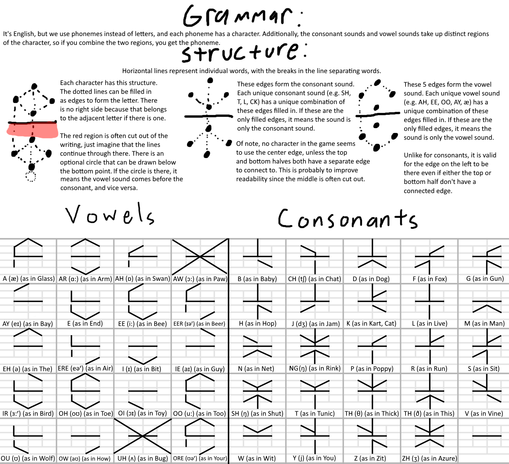

# Tunic Language Translate

캐나다의 인디게임 개발자 Andrew Shouldice가 만든 액션 어드벤처 게임 TUNIC에 등장하는 자체 언어를 번역하기 위한 툴 제작이 목표입니다.

[https://github.com/zerodice0/TunicLanguageTranslate](https://github.com/zerodice0/TunicLanguageTranslate)

# 개요

---

⬅️ 튜닉에 등장하는 자체 언어는 이런 룰을 가지고 있으며, 이미 Reddit에 캔버스를 가지고 만들어진 툴이 있습니다. 또한 이미 영어로 완역된 메뉴얼이 존재하므로, 이 프로젝트 자체가 가지는 큰 의의는 없습니다. 그냥 만들어보고 싶을 뿐(?)입니다.

⬇️ 튜닉의 언어 번역 안내에 대해서는 아래의 문서를 참조해주세요. 아래의 페이지에서는 문자 체계, 번역 툴, 영문 번역된 메뉴얼을 포함합니다.

[Tunic: Language Translation Guide](https://gamerant.com/tunic-game-language-translate-meaning/)

---
